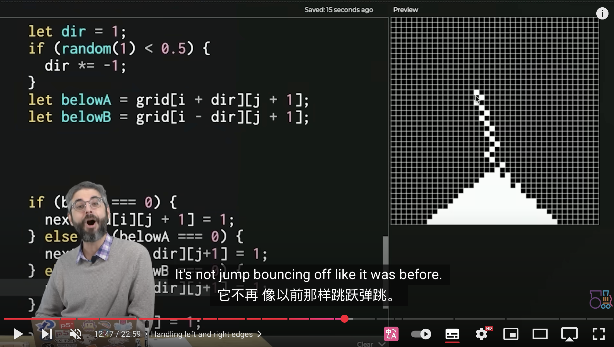

# Quiz 8: Design Research

## Part 1: Imaging Technique Inspiration

As shown in Figure 1, I plan to create a Tetris-like interactive game using a grid-based sand simulation that allows colored sand particles to fall and pile up naturally, maintaining mass and avoiding particle loss. This approach is complex but produces stable and realistic physical and visual effects.

As shown in Figures 2 and 3, I will extend it so that sand grains of different colors fall freely and disappear automatically when matched—similar to Tetris, but with irregular particles instead of squares—thus enhancing interactivity and fun.

  

**Video Source:**  
https://www.youtube.com/watch?v=gXEMOfhFDVk

---

## Part 2: Coding Technique Exploration

Figures 4 and 5 demonstrate the use of a two-dimensional array to encode a grid of pixels: the canvas is divided into cells stored as `grid[row][col]`. This cellular automata approach updates each cell in constant time regardless of grid size, and handles many particles efficiently, supporting the sand simulation technique.

![Figure 4: Encoding pixel grids with `grid[row][col]`](./readmeImages/4.jpg)  

The screenshot captures a red sand particle in the center (green number at the bottom is the frame count). The program allows spraying or removing particles with the mouse. This technique underpins the simulation in Part 1.

**Video Source:**  
https://www.youtube.com/watch?v=L4u7Zy_b868&t=766s

---